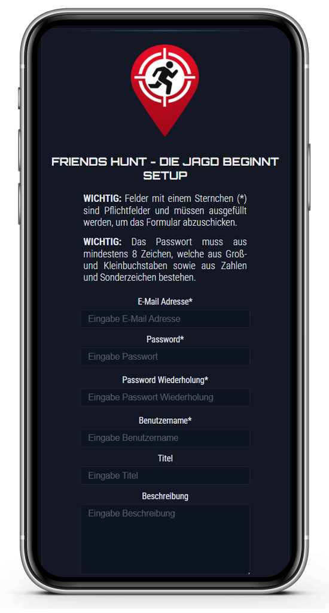
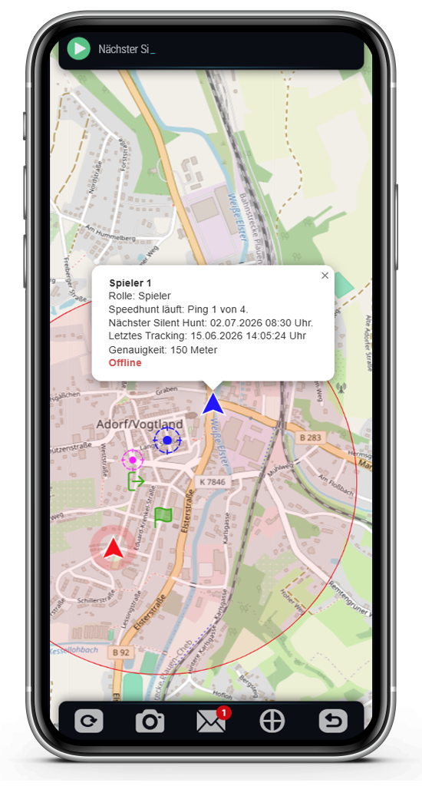
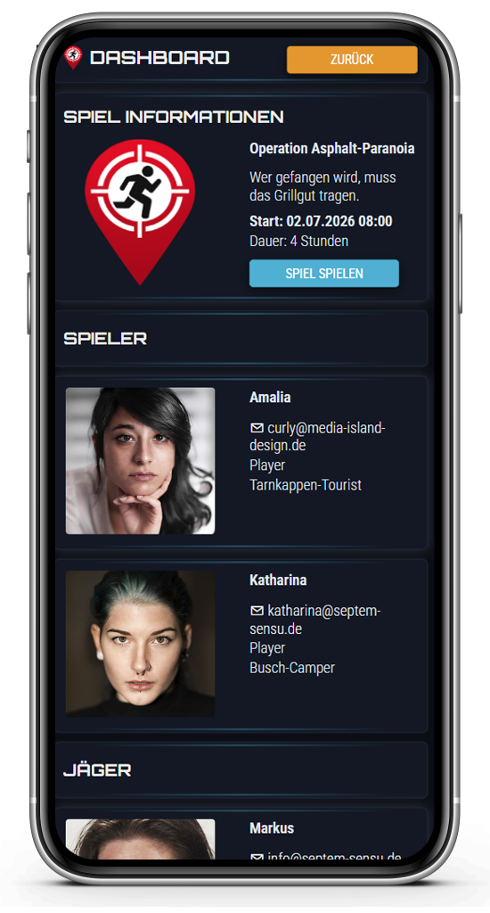
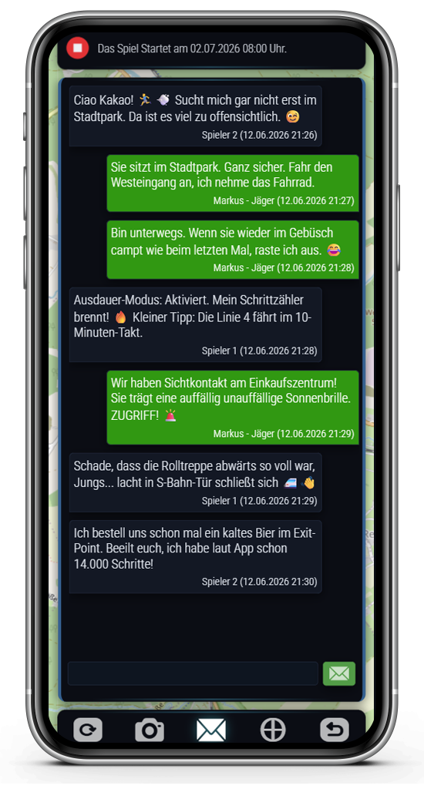
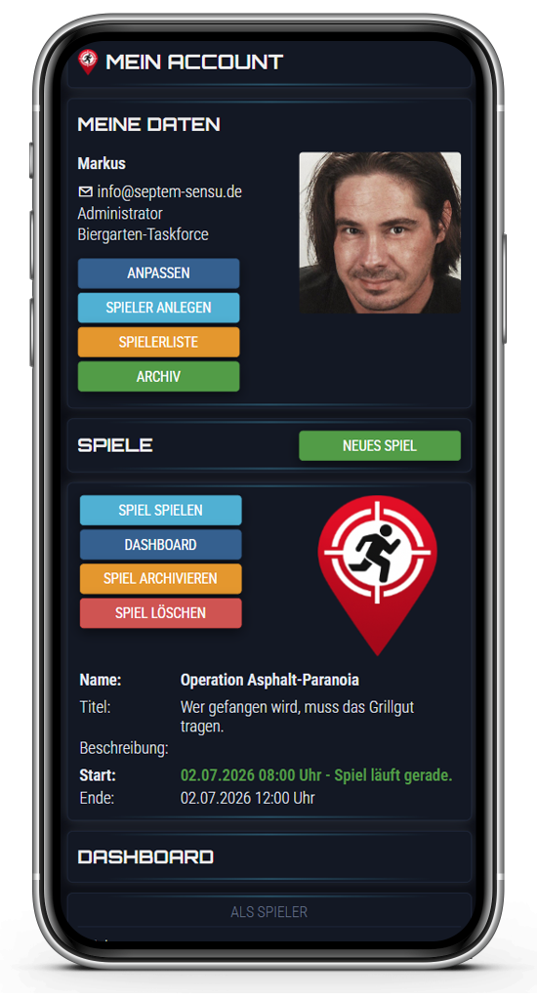
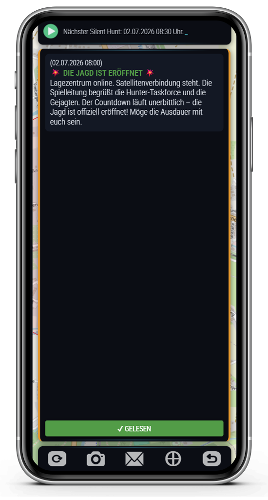
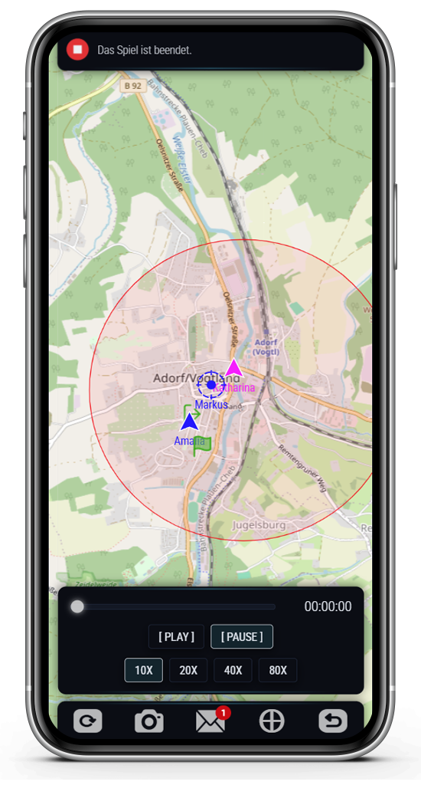
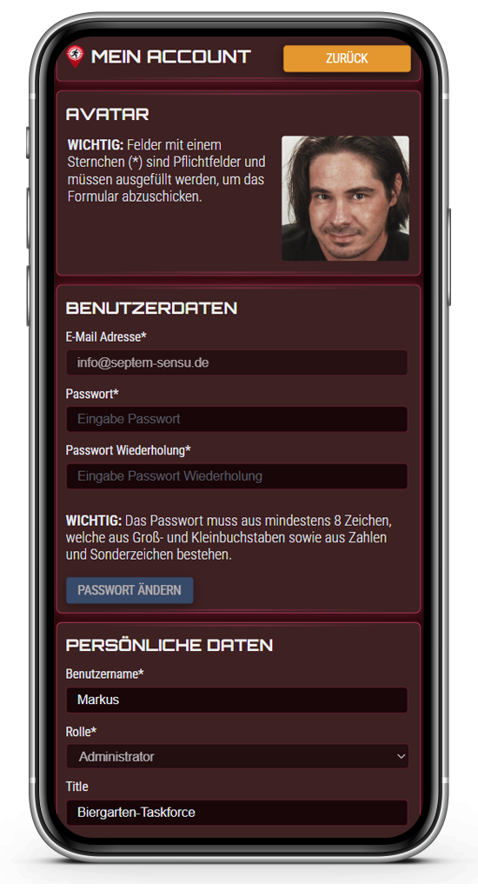

# 🛰️ Friends-Hunt

<p><b>Friends-Hunt ist kein Spiel für das Smartphone.</b></p>
<p><b>Es ist ein Spiel für Freunde – das Smartphone sorgt nur dafür, dass es funktioniert.</b></p>

<table>
  <tr>
    <td><br /><br /><br /></td>
    <td>
      <p><b>Friends-Hunt</b> ist eine selbst-hostbare Progressive Web App (PWA) für Reallife-Geo-Games im Stil bekannter YouTube-Formate. Präzise GPS-Wegpunkte und Intervalle machen dein Smartphone zur mobilen Einsatzzentrale.</p>
    </td>
  </tr>
</table>

<p float="left">
  <a href="https://www.php.net/" target="_blank" title="PHP"></a>
  <a href="https://developer.mozilla.org/de/docs/Web/JavaScript" target="_blank" title="JavaScript"></a>
  <a href="https://developer.mozilla.org/de/docs/Glossary/HTML5" target="_blank" title="HTML5"></a>
  <a href="https://developer.mozilla.org/de/docs/Web/CSS" target="_blank" title="CSS3"></a>
  <a href="https://www.json.org/" target="_blank" title="JSON"></a>
  <a href="https://www.openstreetmap.de/" target="_blank" title="OpenStreetMap"></a>
  <a href="https://leafletjs.com/" target="_blank" title="Leaflet"></a>
  <a href="https://mozilla.org/" target="_blank" title="Progressive Web App (PWA)"></a>
  <a href="LICENSE" target="_blank" title="MIT-Lizenz"></a>
</p>

---

## 🗺️ Screenshots

<table>
  <tr>
    <td align="center"><p>Setup Ansicht</p></td>
    <td align="center"><p>Gameplay Ansicht</p></td>
    <td align="center"><p>Game Dashboard Ansicht</p></td>
    <td align="center"><p>Messages Ansicht</p></td>
  </tr>
  <tr>
    <td align="center"><p>My Account Ansicht</p></td>
    <td align="center"><p>System Messages Ansicht</p></td>
    <td align="center"><p>Replay Player Ansicht</p></td>
    <td align="center"><p>Themes Ansicht</p></td>
  </tr>
</table>

---

## 🎯 Spielprinzip

Ein oder mehrere **Spieler (Gejagte)** versuchen, sich in einem definierten Gebiet unentdeckt zu bewegen und rechtzeitig eine Flucht-Zone zu erreichen. Die **Jäger (Hunter)** versuchen, sie anhand zeitversetzter GPS-Signale aufzuspüren. Die **Spielleitung (optional)** behält die Kontrolle über das Regelwerk und dirigiert das Event im Hintergrund.

- **Die Gejagten:** Bewegen sich strategisch von Start- zu Exit-Positionen und versuchen, den Huntern unter Ausnutzung von Gelände zu entkommen.
- **Die Jäger - (Hunter):** Verfolgen die Positionen der Spieler zeitversetzt auf der Karte. Ein Intervall-Wechsel fordert schnelles Reagieren und clevere Wege.
- **Die Spielleitung (optional):** Behält über das integrierte Nachrichtensystem die Kontrolle und kann Spielern oder Jägern Hinweise zukommen lassen.

---

## ⚡ Key Features

* 📌 **Live-Positionstracking:** mit dynamisch konfigurierbaren Intervallen.
* 🗺️ **OpenStreetMap-Integration:** Vektorkarten via Leaflet – völlig ohne teure API-Kosten.
* 🛡️ **Zero-Database (JSON):** Keine Datenbank erforderlich! Alle Spielzustände werden in JSON-Dateien verwaltet.
* 🔐 **Sicherheit:** JSON-Dateien werden serverseitig via **AES-256-CBC** verschlüsselt abgelegt.
* 👣 **Integrierter Schrittzähler:** Auswertungen der Laufleistung nach dem Spiel direkt über GPS-Distanzberechnungen (Haversine-Formel).
* 🧭 **Offline Queue:** Tracking Signale werden Offline gesammelt und wenn wieder Online an den Server geschickt.
* 💬 **Nachrichtensystem:** Kommunikation zwischen Spielleitung, Jägern und Spielern.
* 👪 **Rollenbasiertes System:** Spielleitung, Jäger, Spieler.
* 📦 **Archiv-Funktion:** Abgelaufene Runden können nach dem Spiel in ein Archiv verschoben werden und stehen für Statistiken im Wirtshaus bereit.

---

## 🚀 Installation & Setup

1. Klicke in GitHub auf **Code -> Download ZIP** oder klone das Repository:
   ```bash
   git clone https://github.com/septem-sensu/friendshunt.git
   ```
2. Lade den Ordner auf deinen PHP-fähigen Webserver (Apache / Nginx) hoch.
3. Stelle sicher, dass der Server über ein **SSL-Zertifikat (HTTPS)** verfügt, da mobile Browser den GPS-Zugriff im unverschlüsselten HTTP-Netz aus Datenschutzgründen blockieren.
4. Rufe die Domain auf, erstelle deinen Account und starte die Jagd!

---

## 📃 Konzept

Friends-Hunt ist ein Reallife-Geo-Game, das von bekannten YouTube-Verfolgungsformaten inspiriert wurde. Ein oder mehrere **Spieler (Player)** versuchen, sich innerhalb eines vorher festgelegten Spielgebiets möglichst unauffällig zu bewegen und rechtzeitig eine definierte Flucht-Zone zu erreichen.

Die **Jäger (Hunter)** verfolgen die Spieler jedoch nicht in Echtzeit. Stattdessen erhalten sie die Positionen der Spieler nur zu bestimmten Zeitpunkten oder über spezielle Spielmechaniken. Dadurch entsteht ein spannendes Katz-und-Maus-Spiel, bei dem beide Seiten taktisch planen müssen.

Die **Spielleitung (optional)** überwacht das Spielgeschehen, achtet auf die Einhaltung der Regeln und kann – falls gewünscht – durch Hinweise oder Ereignisse für mehr Ausgewogenheit und Spannung sorgen.

Das Spiel endet, sobald **alle Spieler gefangen wurden**. In diesem Fall gewinnen die Jäger.

Erreichen die Spieler das Spielende, ohne dass alle gefangen wurden, gewinnen die Spieler.

### Silent Hunt

Beim **Silent Hunt** erhalten die Jäger in festgelegten Zeitabständen die zuletzt bekannte Position aller Spieler. Ein typisches Intervall wäre beispielsweise **jede volle Stunde**.

Zwischen zwei Silent Hunts kennen die Jäger keine neuen Positionen und müssen anhand der letzten bekannten Informationen versuchen, die Spieler aufzuspüren.

### Speed Hunt

Zusätzlich steht den Jägern in festgelegten Zeitabständen ein **Speed Hunt** zur Verfügung.

Während eines Speed Hunts wählen die Jäger **einen beliebigen Spieler** aus. Für diesen Spieler erhalten sie eine begrenzte Anzahl von Positionsabfragen (z. B. **vier Pings**), die sie jederzeit strategisch einsetzen können.

Alle Spieler wissen, dass gerade ein Speed Hunt aktiv ist, **nicht jedoch, welcher Spieler verfolgt wird**. Dadurch weiß auch der betroffene Spieler nicht, ob gerade seine Position abgefragt wird.

Erst nachdem alle verfügbaren Positionsabfragen eines Speed Hunts verbraucht wurden, beginnt die Wartezeit bis zum nächsten Speed Hunt.

---

## 📕 Regeln

### Allgemeine Regeln

- Alle geltenden lokalen und nationalen Gesetze sind jederzeit einzuhalten.
- Körperliche Gewalt ist untersagt.
- Jeder Teilnehmer trägt die Verantwortung für sein eigenes Handeln. Mögliche Konsequenzen (z. B. Bußgelder oder strafrechtliche Folgen) sind selbst zu tragen.

### Regeln für die Spieler

- Ein Spieler gilt als **gefangen**, sobald er von einem Jäger berührt wurde.
- Der gefangene Spieler bestätigt seine Gefangennahme unmittelbar in der Friends-Hunt App.
- Das festgelegte Spielgebiet darf nicht verlassen werden. Verlässt ein Spieler das Spielgebiet, werden die Jäger und die Spielleitung informiert. Seine Position ist für die Jäger sichtbar, bis er das Spielgebiet wieder betritt.
- Spieler dürfen sich ausschließlich an öffentlich zugänglichen Orten aufhalten.
- Längere Aufenthalte in Innenräumen sind nicht erlaubt.
- Die Friends-Hunt App muss jederzeit Positionsdaten übertragen können.
- Die Friends-Hunt App muss während des Spiels dauerhaft im Vordergrund laufen.
- Die Nutzung privater Fahrzeuge ist nicht erlaubt.
- Die Kommunikation mit anderen Spielern erfolgt ausschließlich über die Friends-Hunt App.

### Optionale Regeln für die Spieler

Je nach Spielkonfiguration können zusätzliche Regeln aktiviert werden:

- Spieler können ihre Mitspieler auf der Karte sehen.
- Die Nutzung öffentlicher Verkehrsmittel kann erlaubt oder verboten werden. Ist sie verboten und die Friends-Hunt App erkennt eine Nutzung, werden die Jäger informiert und die Position des Spielers wird sichtbar.
- Ein Mindestabstand zwischen Spielern kann konfiguriert werden. Nähern sich Spieler nach dem ersten Silent Ping einander näher als dieser Abstand, gilt dies als Regelverstoß — die Jäger werden informiert und die Positionen der betroffenen Spieler werden sichtbar.

### Regeln für die Jäger

- Unbeteiligte Personen dürfen nicht aktiv an der Suche oder am Fangen der Spieler beteiligt werden. Das Nachfragen bei Passanten, ob sie einen Spieler gesehen haben, ist ausdrücklich erlaubt.
- Jäger dürfen öffentliche und private Verkehrsmittel nutzen.
- Alle während des Spiels entstehenden Kosten oder Strafen (z. B. Parktickets oder Geschwindigkeitsverstöße) tragen die Jäger selbst.
- Jäger dürfen ihre Kommunikationsmittel frei wählen.
- Gefangene Spieler dürfen zu den verbleibenden Spielern befragt werden.
- Eigenständiges Tracking außerhalb der Friends-Hunt App ist nicht erlaubt.
- Längere Unterbrechungen der Jagd gelten als Regelverstoß.

### Optionale Regeln für die Jäger

Je nach Spielkonfiguration können die Namen der Spieler auf der Karte angezeigt oder ausgeblendet werden.

---

## 👯 Tipps für ein gelungenes Spiel

Friends-Hunt lebt nicht nur von der Jagd, sondern vor allem von den gemeinsamen Erlebnissen. Mit ein paar einfachen Tipps wird aus einer Spielrunde schnell ein unvergesslicher Tag.

### 📍 Wählt ein interessantes Spielgebiet

Ein abwechslungsreiches Gebiet mit Parks, kleinen Gassen, Fußgängerzonen oder Wäldern sorgt für spannende Entscheidungen und kreative Verstecke.

### 👟 Bequeme Schuhe sind Gold wert

Je nach Spielkonfiguration kommen schnell einige Kilometer zusammen. Festes Schuhwerk und wettergerechte Kleidung machen den Tag deutlich angenehmer.

### 🔋 Denkt an euren Akku

Die Friends-Hunt App benötigt während des Spiels GPS. Ein vollständig geladener Akku oder eine kleine Powerbank können den entscheidenden Unterschied machen.

### 💧 Ausreichend trinken

Vor allem an warmen Tagen solltet ihr genügend Wasser dabeihaben. Das Spiel macht deutlich mehr Spaß, wenn niemand wegen Hitze oder Erschöpfung aufgeben muss.

### 🤝 Fair Play macht mehr Spaß

Friends-Hunt lebt von spannenden Entscheidungen und überraschenden Wendungen. Haltet euch an die Regeln und gebt auch euren Mitspielern die Chance auf ein faires und spannendes Spiel.

### 🍻 Lasst den Tag gemeinsam ausklingen

Der eigentliche Gewinner eines Spieltages ist oft die gemeinsame Zeit. Trefft euch nach dem Spiel in einem Biergarten, Restaurant oder bei einem gemütlichen Grillabend, schaut euch gemeinsam das Replay an und erinnert euch an die lustigsten Situationen. Oft entstehen dabei die besten Geschichten – und die Diskussion, wer wen eigentlich fast schon gehabt hätte.

### Viel wichtiger als der Sieg...

...sind die gemeinsamen Erinnerungen.

Friends-Hunt soll Menschen zusammenbringen, für Bewegung sorgen und einen Tag schaffen, an den man sich noch lange erinnert. Ob Spieler oder Hunter am Ende gewinnen, ist oft schon auf dem Heimweg nicht mehr das Gesprächsthema – sondern die verrückten Situationen, die unterwegs entstanden sind.

Also: Spiel starten, Handy einpacken und viel Spaß bei der Jagd!

---

## ⚙️ Spiel-Konfiguration

Jedes Match lässt sich im Administrationsbereich exakt an das Gelände und die Spieleranzahl anpassen:


| Parameter | Beschreibung |
| :--- | :--- |
| **Start & Dauer** | Festlegung von Datum, Uhrzeit und Spielzeit in Stunden. |
| **Tracking-Intervall** | Hintergrund-Standortermittlung. |
| **Silent Hunt Intervall** | Feste Intervalle (Minuten), in denen Jäger reguläre Positions-Updates erhalten. |
| **Speed Hunt Intervall** | Extrem-Phasen (Minuten) mit aufeinanderfolgenden Positions-Updates. |
| **Start- & Exit-Position** | Definition der finalen *Extit Zone* (z. B. eine Gaststätte). |
| **Mitspieler / Namen anzeigen** | Taktische Filter, ob Jäger/Spieler einander auf der Karte sehen und namentlich identifizieren können. |

---

## 🛠️ Technische Architektur

Das Projekt trennt Logik und Darstellung.
Friends-Hunt wurde nach dem Prinzip „Maximale Unabhängigkeit & Sicherheit“ entwickelt. Die Anwendung benötigt keine schwere relationale Datenbank (wie MySQL) und läuft dank optimierter JSON-Strukturen extrem ressourcensparend auf fast jedem Webspace.

Custom MVC, kein Framework. Alle Requests laufen über einen Single Entry Point:
```text
index.php → Controller::execute()
  ├─ ?view= → HTML-Antwort (Seitenansicht)
  └─ ?result= → JSON-Antwort (AJAX)
```

### Technologie-Stack
* **Frontend:** HTML5, Vanilla CSS3 (kein schweres Bootstrap nötig), natives objektorientiertes JavaScript, Web APIs.
* **Karten:** LeafletJS & OpenStreetMap.
* **Backend:** Objektorientiertes PHP.
* **Kommunikation:** Asynchrone PHP <-> JavaScript AJAX-Schnittstellen (JSON-Payloads).
* **Sicherheit:** Cookie-basierte Authentifizierung mit verschlüsselten Tokens, strikte client- und serverseitige Formularvalidierung.

### PHP Klassenstruktur (OOP)
```text
Controller/               # Steuerung der AJAX-Anfragen, Routings, Rollen-Management
Presentation/             # UI-Rendering, Template-Engine, Cookies, Validierung, Logging, CORS
BaseObject/               # Basis-Logiken, AES-verschlüsselte JSON-Datei-Persistenz, CRUD, GUID
  ├── Player/             # Usermanagement, Rollen, Avatare & Auth
  └── Game/               # Spielinstanzen, Spieleinstellungen, Archivierung
        └── Gameplay/     # Geo-Berechnungen, Intervalle & Nachrichtensystem
```

### JavaScript Klassenstruktur (OOP)
```text
Communicator/             # AJAX-Queue mit Retry, Offline-Request-Queue, Redirects
Validator/                # Formularvalidierung, Fehlverwaltung
BatteryTracker/           # Battery Status API
GeoMaps/                  # OpenStreetMaps-Integration über Leaflet, Marker, Capture-Highlight-Flyto, Kartenverfolgung
GeoTracker/               # GPS, Schrittzähler, Wake Lock (iPhone-Hintergrundwechsel berücksichtigt)
Statistic/                # Dashboard-Statistiken
ReplayPlayer/             # Spiel-Replay (Timelapse), inkl. Kartenverfolgung und Regelbrüchen
Utils/                    # Statitische Hilfs-Methoden (GUID, Timestamps, Audio, Vibration)
BaseObject/               # Kern-Objekt mit Basis-Logiken
  ├── Player/             # Login, Usermanagement, Rollen, Avatare & Auth
  └── Game/               # Spielinstanzen, Spiel-Setup, Dashboard, Archiv
        └── Gameplay/     # Laufzeitbetrieb, Intervalle & Nachrichtensystem
```

### Request Flow
1. `Controller::init()` lädt View-Config aus `includes/json/views/<view>.json`
2. View-JSON definiert: Klasse, Templates, erlaubte Rollen, Actions
3. `Controller::checkRole()` validiert Cookie-basierte Session
4. Actions werden ausgeführt, Templates via `Presentation::processTemplate()` mit `{{var}}`-Ersetzung gerendert

### Data Persistence
- Alle Daten liegen als AES-256-CBC-verschlüsselte JSON-Dateien in `includes/json/data/`
- `BaseObject` stellt CRUD-Operationen über `loadFileDeCrypted()` / `saveFileEnCrypted()` bereit
- Uploads in `includes/files/player/` und `includes/files/game/`
- Runtime-Daten während des Spiels in `includes/files/game/<gameId>/` (Tracking, Messages, Gameplay-Status)
- Uploads in `includes/files/player/` und `includes/files/game/`

### View & Template System
Views werden in `includes/json/views/*.json` definiert (Klasse, Templates, Rollen, Actions).
Templates in `includes/templates/*.tmpl` nutzen `{{Class::property}}`-Platzhalter.
Field-Definitionen in `includes/json/fields/*.json` steuert Formularfeld-Metadaten (Typ, Pflicht, Validierung).

### Roles & Auth
- `guest` (nicht authentifiziert), `player` (eingeloggt), `administrator`
- Cookie-basierte Auth mit AES-verschlüsseltem Token (`playerEmail|||hashedPassword`)
- Methoden-Zugriffskontrolle in `includes/json/data/dataPermissions.json`

### PWA & Service Worker
- **Manifest:** includes/json/manifest.json
- **Service Worker:** registriert unter `scope: /`
  - Statisches Asset-Caching, Versionierung über `CACHE_NAME` (z. B. `friendshunt-v0.1.0.xx`)
  - Separater Leaflet-Kachel-Cache (`friendshunt-tiles-v1`) mit 2-Stunden-TTL und Hintergrundaktualisierung
  - Erkennung von Tile-Hosts: `tile.openstreetmap.org`, `tile.opentopomap.org`
  - Non-HTTP-Requests (Browser-Extensions etc.) werden robust gefiltert
- **App Install Button** ist in Betrieb

### Client Storages
```text
Cookie            # Session Cookie (Login Check)
Local storage     # Last Message Id, Dont Show System Messages
Indexed DB        # Offline Tracking Queue
```

### Key Conventions
- PHP: `declare(strict_types=1)` in allen Dateien
- PHP-Klassen nutzen phpDocumentor-Kommentare
- JS: Vanilla ES6 Classes, kein Framework
- CSS: Custom Properties für Theming (`includes/css/themes/`), Mobile-First mit 650px-Breakpoint
- Leaflet.js ist als einzige Third-Party-Lib in `includes/libs/leaflet/` gebundelt

---

## 📄 Lizenz

Dieses Projekt ist unter der [**MIT-Lizenz**](LICENSE) lizenziert. Du kannst es für deine privaten Spiele nutzen, modifizieren und erweitern.

---
*Entwickelt mit ❤️ für Freunde. Bereit für die Flucht?*
