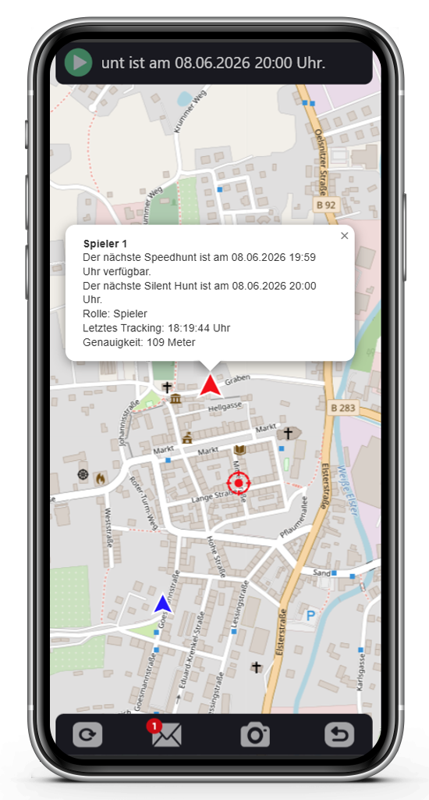
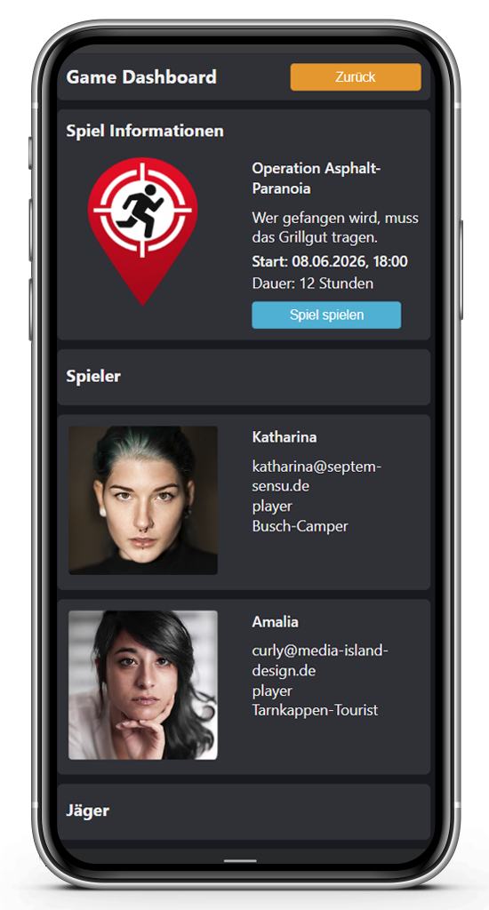
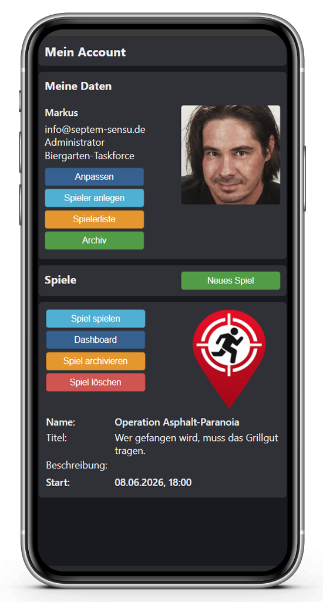
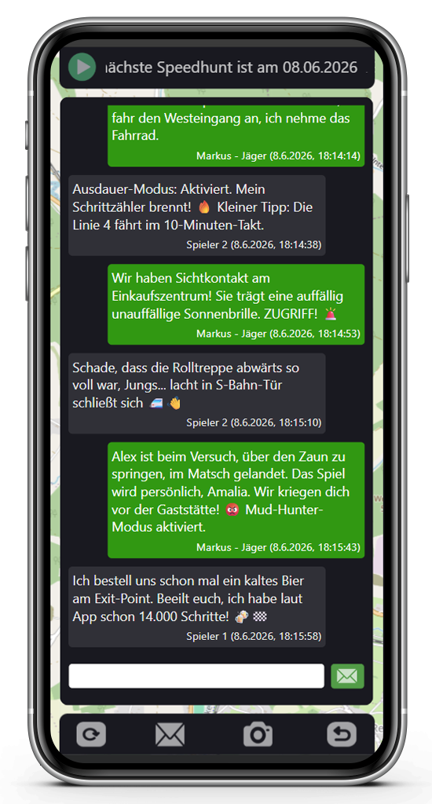

# 🛰️ Friends-Hunt

<table>
  <tr>
    <td><br /><br /><br /></td>
    <td><b>Friends-Hunt</b> ist eine Progressive Web App (PWA) für spektakuläre Reallife-Geo-Games im Stil bekannter YouTube-Formate. Eine präzise GPS-Fährte und taktische Intervalle dein Smartphone zur mobilen Einsatzzentrale.</td>
  </tr>
</table>

---

## 🗺️ Screenshots

<table>
  <tr>
    <td></td>
    <td></td> 
    <td></td> 
    <td></td> 
  </tr>
</table>

---

## 🎯 Das Spielprinzip

Ein oder mehrere **Spieler (Gejagte)** versuchen, sich in einem definierten Gebiet unentdeckt zu bewegen und rechtzeitig eine Flucht-Zone zu erreichen. Die **Jäger (Hunter)** versuchen, sie anhand zeitversetzter GPS-Signale aufzuspüren. Die **Spielleitung (Admin)** behält die volle Kontrolle über das Regelwerk und dirigiert das Event im Hintergrund.

- **Die Gejagten:** Bewegen sich strategisch von Start- zu Exit-Positionen und versuchen, den Hunter unter Ausnutzung von Gelände und Schrittzähler-Boni zu entkommen.
- **Die Jäger - (Hunter):** Verfolgen die Positionen der Spieler live auf der Karte. Taktische Intervall-Wechsel fordern schnelles Reagieren und clevere Laufwege.
- **Die Spielleitung (optional):** Behält über das integrierte Nachrichtensystem die volle Kontrolle und kann Spielern oder Jägern Hinweise und Anweisungen zukommen lassen.

---

## ⚡ Key Features

* 🗺️ **OpenStreetMap-Integration:** Hochperformante, gestochen scharfe Vektorkarten via Leaflet – völlig ohne teure Google-API-Kosten.
* 🛡️ **Zero-Database (JSON):** Keine Datenbank (MySQL etc.) erforderlich! Alle Spielzustände werden in blitzschnellen JSON-Dateien verwaltet.
* 🔐 **Militärische Sicherheit:** Die JSON-Dateien werden serverseitig via **AES-256-CBC** verschlüsselt abgelegt. Kein Jäger kann die Daten unbefugt auslesen.
* 👣 **Integrierter Schrittzähler:** Taktische Auswertung der Laufleistung nach dem Spiel direkt über GPS-Distanzberechnungen (Haversine-Formel).
* 💬 **Taktisches Nachrichtensystem:** Nahtlose Echtzeit-Kommunikation zwischen Spielleitung, Jägern und Spielern für Missions-Updates und Event-Ankündigungen.
* 📦 **Archiv-Funktion:** Abgelaufene Runden werden nach dem Spiel automatisch in ein Archiv verschoben und stehen für Statistiken im Wirtshaus bereit.

---

## ⚙️ Spiel-Konfiguration (Vollständig anpassbar)

Jedes Match kann über das Admin-Dashboard bis ins kleinste Detail maßgeschneidert konfiguriert werden:


| Parameter | Beschreibung |
| :--- | :--- |
| **Start & Dauer** | Festlegung von Datum, Uhrzeit und Spielzeit in Stunden. |
| **Tracking-Intervall** | Taktung der Hintergrund-Standortermittlung (Sekundengenau). |
| **Silent Hunt Intervall** | Feste Intervalle (Minuten), in denen Jäger reguläre Updates erhalten. |
| **Speed Hunt Intervall** | Extrem-Phasen (Minuten) mit rasant aufeinanderfolgenden Live-Schnitten. |
| **Start- & Exit-Position** | Definition der Dropzone sowie der finalen *Extraction Zone* (z. B. eine Gaststätte). |
| **Mitspieler / Namen anzeigen** | Taktische Filter, ob Jäger/Spieler einander auf der Karte sehen und namentlich identifizieren können. |

---

## 🛠️ Technische Architektur

Das Projekt trennt Logik und Darstellung strikt nach modernen Programmier-Paradigmen. Das Backend agiert als passiver, extrem sicherer Datensammler, während die Smartphones der Clients die Berechnungen übernehmen.

### PHP Klassenstruktur (OOP)
```text
Controller/               # Steuerung der AJAX-Anfragen & Routings
Presentation/             # UI-Rendering und Template-System
BaseObject/               # Abstraktes Kern-Objekt mit Basis-Logiken
  ├── Player/             # Usermanagement, Rollen, Avatare & Auth
  └── Game/               # Spielinstanzen & JSON-File-Handling
        └── Gameplay/     # Geo-Berechnungen, Intervalle & Nachrichtensystem
```

### Technologie-Stack
* **Frontend:** HTML5, Vanilla CSS3 (kein schweres Bootstrap nötig), native JavaScript Web APIs.
* **Karten:** LeafletJS & OpenStreetMap.
* **Backend:** Objektorientiertes PHP.
* **Kommunikation:** Asynchrone PHP <-> JavaScript AJAX-Schnittstellen (JSON-Payloads).
* **Sicherheit:** Cookie-basierte Authentifizierung mit verschlüsselten Tokens, strikte client- und serverseitige Formularvalidierung.

---

## 🚀 Installation & Setup

1. Klicke auf GitHub auf **Code -> Download ZIP** oder klone das Repository:
   ```bash
   git clone https://github.com/septem-sensu/friendshunt.git
   ```
2. Lade den Ordner auf deinen PHP-fähigen Webserver (Apache / Nginx) hoch.
3. Stelle sicher, dass der Server über ein **SSL-Zertifikat (HTTPS)** verfügt, da mobile Browser den GPS-Zugriff im unverschlüsselten HTTP-Netz aus Datenschutzgründen blockieren.
4. Rufe die Domain auf, erstelle deinen Account und starte die Jagd!

---

## 📄 Lizenz

Dieses Projekt ist unter der **MIT-Lizenz** lizenziert. Du kannst es für deine privaten Spiele nutzen, modifizieren und erweitern.

---
*Entwickelt mit ❤️ von Freunden für Freunde. Bereit für die Flucht?*
